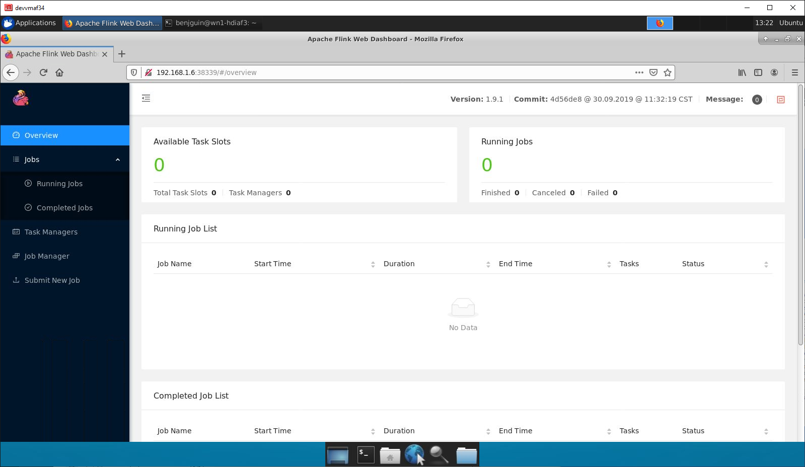

# Host Apache Flink on HDInsight

## resources

- <https://ci.apache.org/projects/flink/flink-docs-release-1.9/ops/deployment/yarn_setup.html>

## test logs

```bash
reporoot=`pwd`
cd $reporoot/devenv/env1
. ./setupHDInsightCluster.sh
```

connect to the cluster

```bash
reporoot=`pwd`
cd $reporoot/devenv/env1
source incl_initvars.sh
ssh -i $sshPrivateKeyPath ${username}@${hdiSshEndpoint}
```

from the cluster:

```bash
# get the hadoop2 package from the Flink download page at
# http://flink.apache.org/downloads.html
afbits="http://apache.mediamirrors.org/flink/flink-1.9.1/flink-1.9.1-bin-scala_2.12.tgz"
afbitsname=`basename $afbits`
echo $afbitsname
curl -O $afbits
tar xvzf $afbitsname
cd flink-1.9.1/
export HADOOP_CLASSPATH=`hadoop classpath`
./bin/yarn-session.sh -jm 1024m -tm 4096m
```

Example output:

```
benjguin@hn0-hdiaf3:~/flink-1.9.1$ ./bin/yarn-session.sh -jm 1024m -tm 4096m
SLF4J: Class path contains multiple SLF4J bindings.
SLF4J: Found binding in [jar:file:/home/benjguin/flink-1.9.1/lib/slf4j-log4j12-1.7.15.jar!/org/slf4j/impl/StaticLoggerBinder.class]
SLF4J: Found binding in [jar:file:/usr/hdp/3.1.2.1-1/hadoop/lib/slf4j-log4j12-1.7.25.jar!/org/slf4j/impl/StaticLoggerBinder.class]
SLF4J: See http://www.slf4j.org/codes.html#multiple_bindings for an explanation.
SLF4J: Actual binding is of type [org.slf4j.impl.Log4jLoggerFactory]
2019-10-25 13:11:15,318 INFO  org.apache.flink.configuration.GlobalConfiguration            - Loading configuration property: jobmanager.rpc.address, localhost
2019-10-25 13:11:15,320 INFO  org.apache.flink.configuration.GlobalConfiguration            - Loading configuration property: jobmanager.rpc.port, 6123
2019-10-25 13:11:15,320 INFO  org.apache.flink.configuration.GlobalConfiguration            - Loading configuration property: jobmanager.heap.size, 1024m
2019-10-25 13:11:15,321 INFO  org.apache.flink.configuration.GlobalConfiguration            - Loading configuration property: taskmanager.heap.size, 1024m
2019-10-25 13:11:15,321 INFO  org.apache.flink.configuration.GlobalConfiguration            - Loading configuration property: taskmanager.numberOfTaskSlots, 1
2019-10-25 13:11:15,322 INFO  org.apache.flink.configuration.GlobalConfiguration            - Loading configuration property: parallelism.default, 1
2019-10-25 13:11:15,323 INFO  org.apache.flink.configuration.GlobalConfiguration            - Loading configuration property: jobmanager.execution.failover-strategy, region       
2019-10-25 13:11:15,844 WARN  org.apache.hadoop.util.NativeCodeLoader                       - Unable to load native-hadoop library for your platform... using builtin-java classes 
where applicable
2019-10-25 13:11:15,956 INFO  org.apache.flink.runtime.security.modules.HadoopModule        - Hadoop user set to benjguin (auth:SIMPLE)
2019-10-25 13:11:16,541 INFO  org.apache.hadoop.yarn.client.RequestHedgingRMFailoverProxyProvider  - Created wrapped proxy for [rm1, rm2]
2019-10-25 13:11:16,542 INFO  org.apache.hadoop.yarn.client.AHSProxy                        - Connecting to Application History server at headnodehost/192.168.1.21:10200
2019-10-25 13:11:16,588 INFO  org.apache.hadoop.yarn.client.RequestHedgingRMFailoverProxyProvider  - Looking for the active RM in [rm1, rm2]...
2019-10-25 13:11:16,768 INFO  org.apache.hadoop.yarn.client.RequestHedgingRMFailoverProxyProvider  - Found active RM [rm2]
2019-10-25 13:11:16,818 INFO  org.apache.hadoop.conf.Configuration                          - found resource resource-types.xml at file:/etc/hadoop/3.1.2.1-1/0/resource-types.xml
2019-10-25 13:11:16,952 WARN  org.apache.flink.yarn.AbstractYarnClusterDescriptor           - The JobManager or TaskManager memory is below the smallest possible YARN Container size. The value of 'yarn.scheduler.minimum-allocation-mb' is '3072'. Please increase the memory size.YARN will allocate the smaller containers but the scheduler will account for the minimum-allocation-mb, maybe not all instances you requested will start.
2019-10-25 13:11:16,952 INFO  org.apache.flink.yarn.AbstractYarnClusterDescriptor           - Cluster specification: ClusterSpecification{masterMemoryMB=3072, taskManagerMemoryMB=4096, numberTaskManagers=1, slotsPerTaskManager=1}
2019-10-25 13:11:17,366 INFO  org.apache.hadoop.metrics2.impl.MetricsConfig                 - Loaded properties from hadoop-metrics2-azure-file-system.properties
2019-10-25 13:11:17,370 INFO  org.apache.hadoop.metrics2.sink.WasbAzureIaasSink             - Init starting.
2019-10-25 13:11:17,370 INFO  org.apache.hadoop.metrics2.sink.AzureIaasSink                 - Init starting. Initializing MdsLogger.
2019-10-25 13:11:17,373 INFO  org.apache.hadoop.metrics2.sink.AzureIaasSink                 - Init completed.
2019-10-25 13:11:17,374 INFO  org.apache.hadoop.metrics2.sink.WasbAzureIaasSink             - Init completed.
2019-10-25 13:11:17,404 INFO  org.apache.hadoop.metrics2.impl.MetricsSinkAdapter            - Sink azurefs2 started
2019-10-25 13:11:17,472 INFO  org.apache.hadoop.metrics2.impl.MetricsSystemImpl             - Scheduled Metric snapshot period at 60 second(s).
2019-10-25 13:11:17,472 INFO  org.apache.hadoop.metrics2.impl.MetricsSystemImpl             - azure-file-system metrics system started
2019-10-25 13:11:39,939 WARN  org.apache.flink.yarn.AbstractYarnClusterDescriptor           - The configuration directory ('/home/benjguin/flink-1.9.1/conf') contains both LOG4J and Logback configuration files. Please delete or rename one of them.
2019-10-25 13:11:46,223 INFO  org.apache.hadoop.metrics2.impl.MetricsSystemImpl             - Stopping azure-file-system metrics system...
2019-10-25 13:11:46,225 INFO  org.apache.hadoop.metrics2.impl.MetricsSinkAdapter            - azurefs2 thread interrupted.
2019-10-25 13:11:46,226 INFO  org.apache.hadoop.metrics2.impl.MetricsSystemImpl             - azure-file-system metrics system stopped.
2019-10-25 13:11:46,226 INFO  org.apache.hadoop.metrics2.impl.MetricsSystemImpl             - azure-file-system metrics system shutdown complete.
2019-10-25 13:11:46,231 INFO  org.apache.flink.yarn.AbstractYarnClusterDescriptor           - Submitting application master application_1572002628390_0001
2019-10-25 13:11:46,610 INFO  org.apache.hadoop.yarn.client.api.impl.YarnClientImpl         - Submitted application application_1572002628390_0001
2019-10-25 13:11:46,610 INFO  org.apache.flink.yarn.AbstractYarnClusterDescriptor           - Waiting for the cluster to be allocated
2019-10-25 13:11:46,617 INFO  org.apache.flink.yarn.AbstractYarnClusterDescriptor           - Deploying cluster, current state ACCEPTED
2019-10-25 13:12:02,086 INFO  org.apache.flink.yarn.AbstractYarnClusterDescriptor           - YARN application has been deployed successfully.
2019-10-25 13:12:02,952 INFO  org.apache.flink.runtime.rest.RestClient                      - Rest client endpoint started.
Flink JobManager is now running on wn4-hdiaf3.1gikcrrtgzuuddjnkmgltmeldg.ax.internal.cloudapp.net:38339 with leader id 00000000-0000-0000-0000-000000000000.
JobManager Web Interface: http://wn4-hdiaf3.1gikcrrtgzuuddjnkmgltmeldg.ax.internal.cloudapp.net:38339
```


e.g. of Web Interface:

<http://wn4-hdiaf3.1gikcrrtgzuuddjnkmgltmeldg.ax.internal.cloudapp.net:38339> which corresponds to (e.g.) <http://192.168.1.6:38339>
and it can be seen from an X2Go session in the devvm (ssh tunnel would be another option):



back to the headnode:

```
Unknown command ''. Showing help:
Available commands:
help - show these commands
stop - stop the YARN session
stop
2019-10-25 13:25:02,304 INFO  org.apache.flink.runtime.rest.RestClient                      - Shutting down rest endpoint.
2019-10-25 13:25:02,321 INFO  org.apache.flink.runtime.rest.RestClient                      - Rest endpoint shutdown complete.
2019-10-25 13:25:02,329 INFO  org.apache.flink.yarn.cli.FlinkYarnSessionCli                 - Deleted Yarn properties file at /tmp/.yarn-properties-benjguin
2019-10-25 13:25:02,333 INFO  org.apache.flink.yarn.cli.FlinkYarnSessionCli                 - Application application_1572002628390_0001 finished with state FINISHED and final state SUCCEEDED at 1572009902259
benjguin@hn0-hdiaf3:~/flink-1.9.1$ 
```
